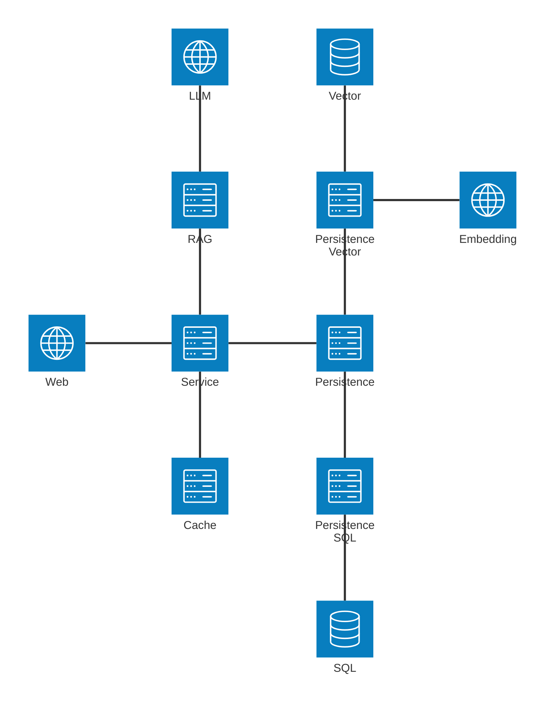

# Sandbox Knowledge Assistant

This application is a Streamlit-based task management system integrated with Retrieval-Augmented Generation (RAG) using Google Generative AI and LangChain. It allows users to manage tasks (e.g., add, update, view, and filter them) while providing an AI-powered conversational interface for querying tasks.

## High-Level Overview
The codebase forms a web application for a "Sandbox To Do" system. It uses SQLite for persistent storage of tasks, LangChain for RAG capabilities, and Streamlit for the user interface. The architecture emphasizes modularity, with separate modules for database operations, UI components, caching, and AI integration. Key features include task CRUD operations, caching for performance, and a chat-based assistant for task-related queries. The system tracks changes via a versioning mechanism to ensure data consistency in cached views.

## Key Components and Files
1. Database Layer (/database/rag_task_db.py)
This module handles database interactions using SQLite. It defines a TaskDatabase class that manages connections, schema creation, and operations like adding, updating, retrieving, and deleting tasks. Tasks are stored with fields like title, description, tags, and timestamp. Additional features include:

- A versioning system to track changes (e.g., via a cache_versions table) for cache invalidation.
- Methods to populate the database from a JSON file and truncate tables for test data.
- Decorators (e.g., @version_aware) ensure that write operations (like adding or updating tasks) increment a version number, which helps synchronize with other parts of the system.
Core functionality focuses on reliability, with error logging and transaction handling to prevent data corruption.

2. RAG System (/rag/rag_system.py)
This file implements the RAG pipeline for AI-assisted task querying. It includes:

- A function to convert task data into LangChain Document objects for embedding.
- Initialization of the RAG system, which involves:
    - Checking for a Google API key.
    - Loading tasks from the database.
    - Creating embeddings using Google Generative AI.
    - Building a FAISS vector store for efficient similarity search.
    - Setting up a conversational chain with LangChain for question-answering. The system returns a conversational retrieval chain and task data, enabling features like task recommendations or queries.

3. UI Main Entry (/ui/rag_ui.py)

   This is the application's entry point, running the Streamlit app. It:

- Configures the page layout and initializes session state for managing chat history, memory, and other dynamic elements.
- Sets up the database and cache services.
- Integrates sub-components for task management and the AI assistant.
- Ensures the RAG system is initialized only when needed, using session state to persist data across interactions. The file orchestrates the overall flow, making it easy to add or modify UI elements.

4. Task Management UI (/ui/rag_task_management.py)

   This module handles the interactive task interface, including:

- Displaying, filtering, adding, and editing tasks.
Using a cache service for quick data access and filtering by tags.
- Forms for adding or updating tasks, with validation (e.g., requiring a title).
- Reinitialization of the RAG system after changes to reflect updated data. It includes utility functions like debouncing to prevent rapid UI actions and manages session state for modes like "add" or "edit."

5. Caching Service (/ui/rag_cache.py)

    A simple caching layer to optimize database queries. The CacheService class:

- Loads tasks from the database and stores them in Streamlit session state.
- Checks for version mismatches to reload data when the database changes.
- Provides methods to get tasks (with optional filtering by tags) and invalidate the cache. This helps reduce database hits, improving performance in the UI.

6. Task Assistant UI (/ui/rag_task_assist.py)

    This file manages the conversational AI interface, allowing users to ask questions about tasks. It:

- Displays chat history and a input field for queries.
- Uses the RAG chain to process user inputs and generate responses.
- Handles errors (e.g., if the system isn't initialized) and provides example questions. The module ensures a smooth chat experience by updating session state and rerunning the UI as needed.

## Main Functionalities
- Task Operations: Users can add, update, view, and filter tasks by tags. Changes trigger cache invalidation and RAG system reinitialization.
- AI Assistance: Leverages RAG to answer task-related questions, such as finding tasks by tags or priorities.
- Performance and Reliability: Caching and versioning minimize redundant queries, while logging and error handling enhance robustness.
- User Experience: Streamlit-based UI with forms, filters, and chat interfaces for intuitive interaction.

## Architecture and Best Practices
The codebase follows a modular design, separating concerns (e.g., data access, business logic, and UI). It uses Streamlit's session state for state management, LangChain for AI workflows, and SQLite for lightweight persistence. Potential strengths include good use of decorators for versioning and caching to handle data consistency. Areas

## Exeuction
1. Set the enviornment variable for Google API Key in Windows Power Shell by: 
    ```
    $env:GOOGLE_API_KEY = "your_api_key_here"
    echo $env:GOOGLE_API_KEY
    ```
2. Run Streamkit
    ```
    streamlit run todo.rag.main.py
    ```


## Archtiecture

[PNG](doc/img/llm.todo.architecture.png)

## To Do
- hosting env
- auth 
- admin settings
- demo / rate limit 
- initialise md files upload
- add new md file 
- handle file update, vector db update
- replacement of FAISS with Chroma or pgVector. 5. existing efficiency of the rag handling when task is edited. 
