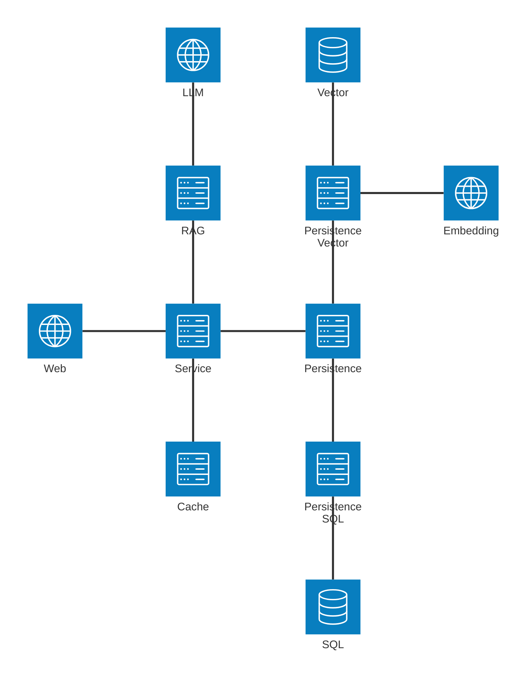

# Notes
## Update Audits
1. Directly use LLM for finding tasks actually very accurate and fast, even for 100 items, altough the concern of scalability and efficiency still remains. Therefore the use of embeddings is introduced in this version of implementation. 
2. `all-MiniLM-L6-v2` model is not accurate for finding revelant texts, swithed to `all-mpnet-base-v2`. 
3. Introduce LLM enhancement prompt for task description (and query) in order to improve matching. `EnhancedVectorIndex` 

## Exeuction
1. Set the enviornment variable for Google API Key in Windows Power Shell by: 
    ```
    $env:GOOGLE_API_KEY = "your_api_key_here"
    echo $env:GOOGLE_API_KEY
    ```
2. Run Streamkit
    ```
    streamlit run todo.rag.main.py
    ```


## Archtiecture

[PNG](doc/img/llm.todo.architecture.png)